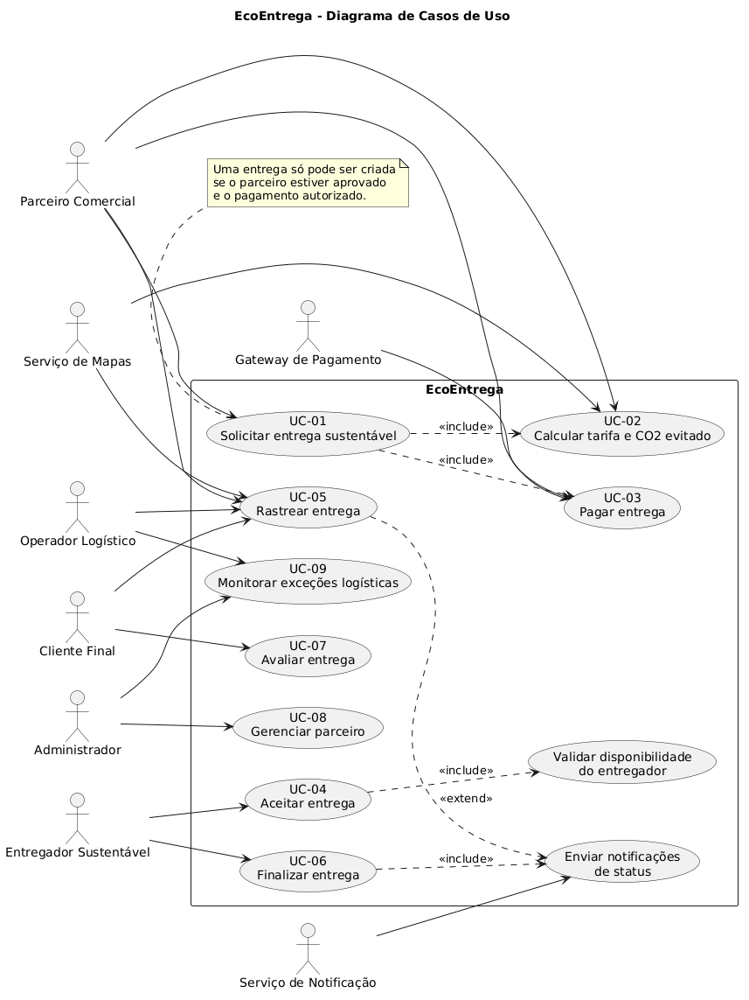
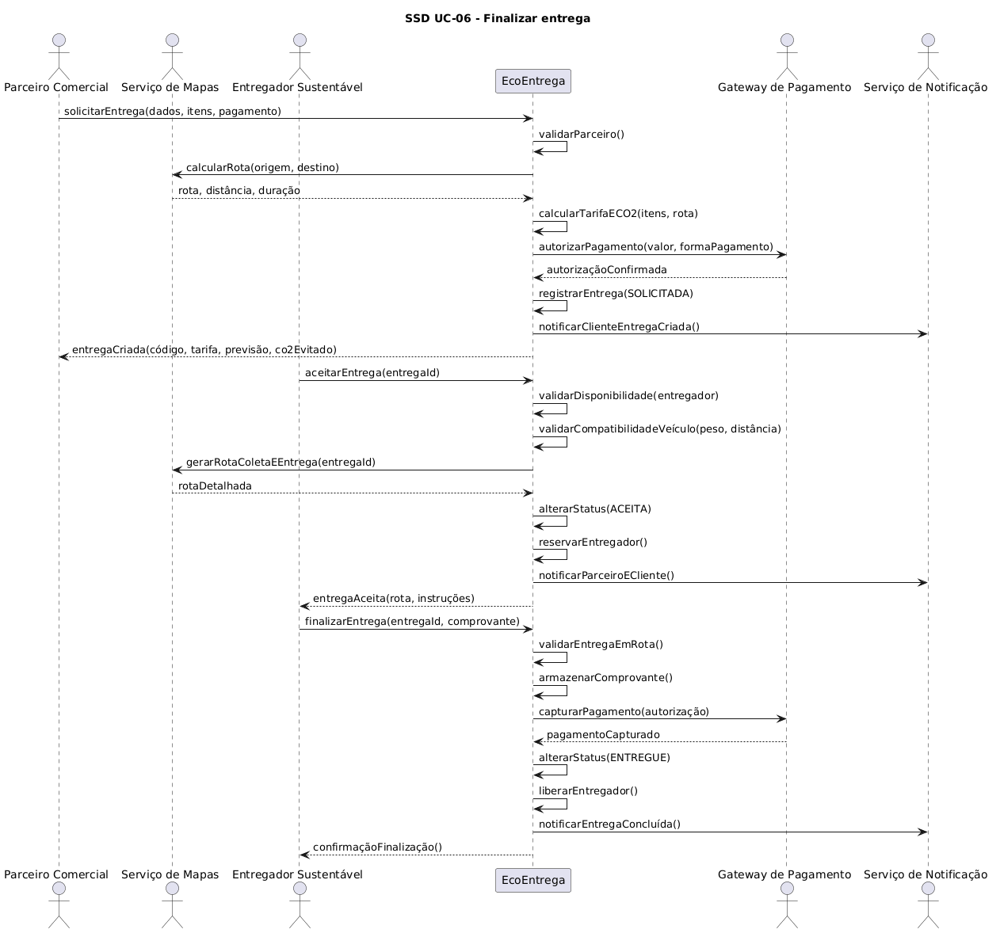
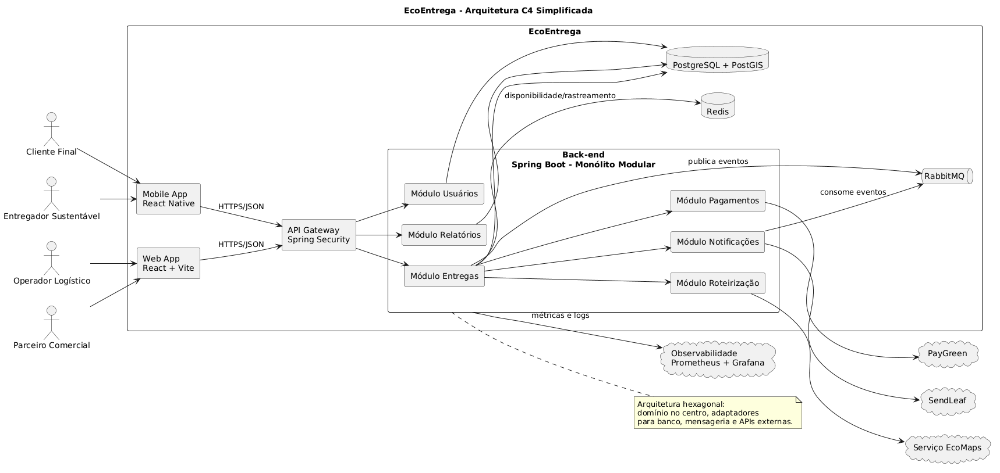
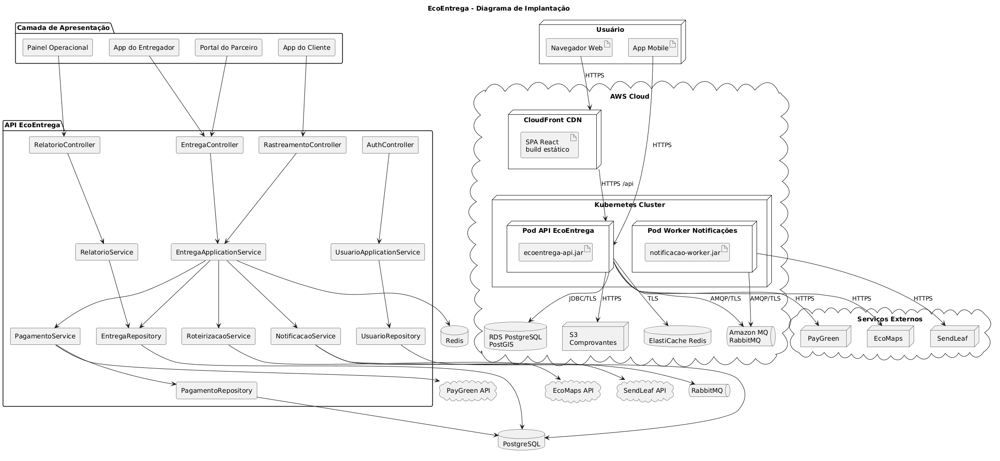
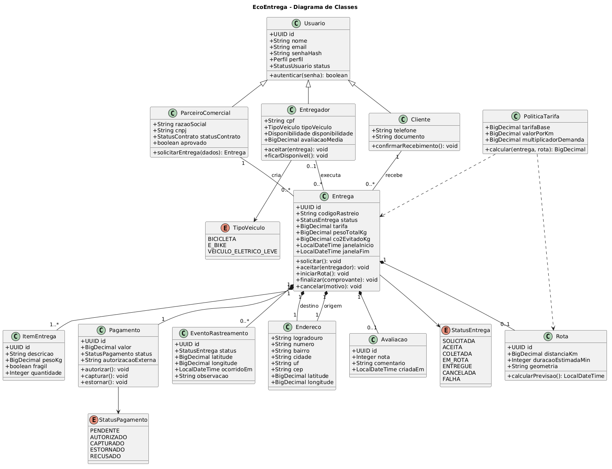
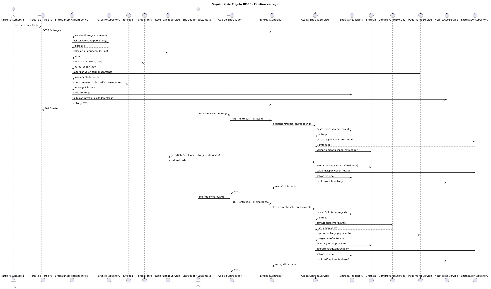
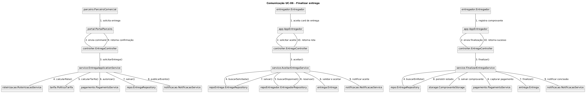
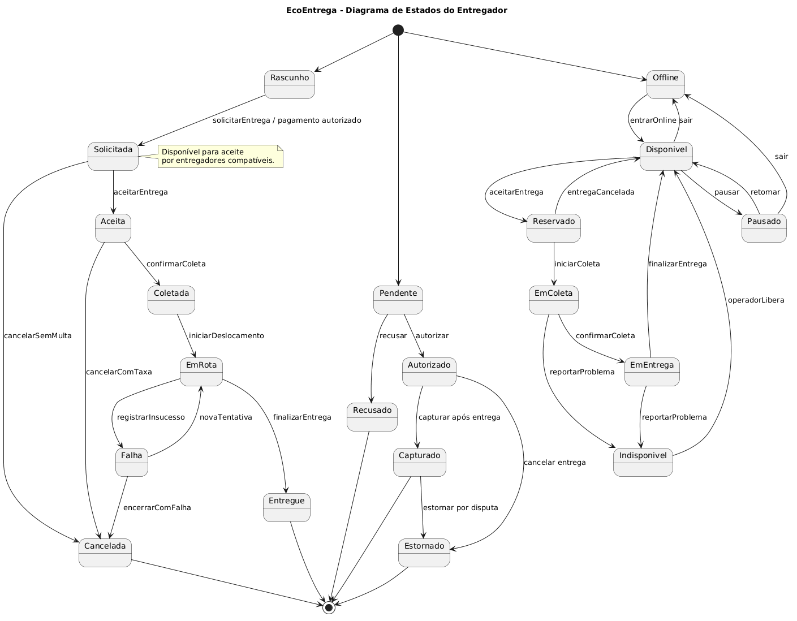
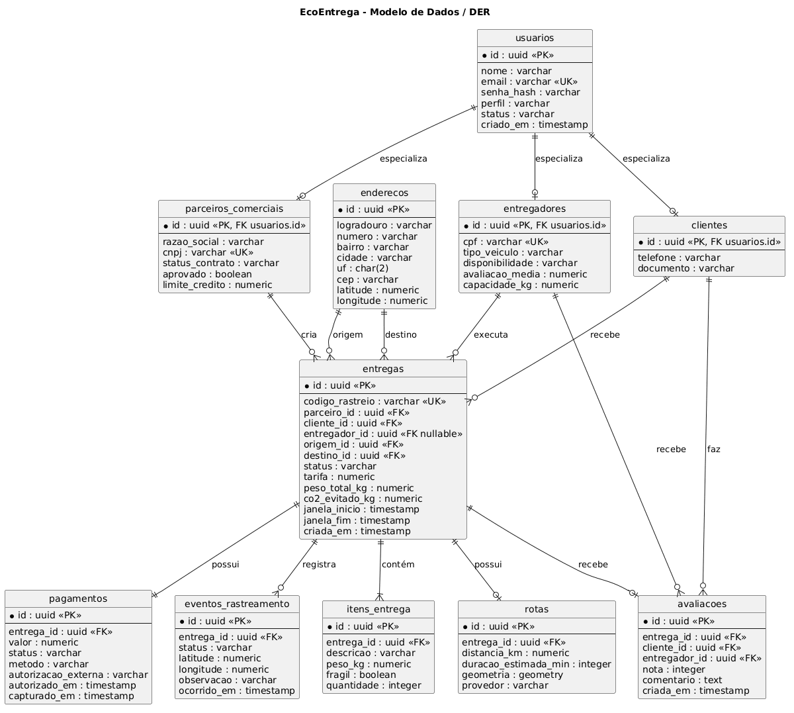

<div align="center">

# EcoEntrega

### Plataforma inteligente para entregas urbanas sustentáveis

**Documentação de Projeto | Versão 1.0 | Projeto de Software**

<br>


<br>

<b>Sistema fictício modelado para conectar comércios, clientes e entregadores sustentáveis por meio de rotas inteligentes, rastreamento e cálculo de impacto ambiental.</b>

</div>

---

## Cartão do Projeto

| Item | Informação |
| --- | --- |
| **Nome do sistema** | EcoEntrega |
| **Versão** | 1.0 |
| **Disciplina** | Projeto de Software |
| **Elaborado por** | Júlia Rocha Fiorini |
| **Data de criação** | 08/06/2026 |
| **Tipo de entrega** | Projeto, arquitetura e diagramação |
| **Ferramenta obrigatória** | PlantUML |
| **Implementação de código** | Não faz parte do escopo |

> Este repositório documenta o projeto de um sistema completo, com foco em análise, arquitetura, diagramas UML, regras de negócio, contratos de operação e modelo de dados.

---

## Visão Rápida

<table>
  <tr>
    <td width="33%">
      <b>Problema</b><br>
      Pequenos negócios precisam entregar produtos com previsibilidade, menor custo operacional e menor impacto ambiental.
    </td>
    <td width="33%">
      <b>Solução</b><br>
      Uma plataforma que calcula rotas sustentáveis, conecta entregadores compatíveis e monitora cada etapa da entrega.
    </td>
    <td width="33%">
      <b>Resultado esperado</b><br>
      Entregas urbanas mais rastreáveis, organizadas e ambientalmente responsáveis.
    </td>
  </tr>
</table>

---

## Tabela de Conteúdo

1. [Introdução](#1-introdução)
2. [Modelos de Usuário e Requisitos](#2-modelos-de-usuário-e-requisitos)
   - [2.1 Descrição de Atores](#21-descrição-de-atores)
   - [2.2 Modelo de Casos de Uso e Histórias de Usuários](#22-modelo-de-casos-de-uso-e-histórias-de-usuários)
   - [2.3 Diagrama de Sequência do Sistema e Contrato de Operações](#23-diagrama-de-sequência-do-sistema-e-contrato-de-operações)
3. [Modelos de Projeto](#3-modelos-de-projeto)
   - [3.1 Arquitetura](#31-arquitetura)
   - [3.2 Diagrama de Componentes e Implantação](#32-diagrama-de-componentes-e-implantação)
   - [3.3 Diagrama de Classes](#33-diagrama-de-classes)
   - [3.4 Diagramas de Sequência](#34-diagramas-de-sequência)
   - [3.5 Diagramas de Comunicação](#35-diagramas-de-comunicação)
   - [3.6 Diagramas de Estados](#36-diagramas-de-estados)
4. [Modelos de Dados](#4-modelos-de-dados)
5. [Referências](#referências)

---

## Galeria de Diagramas

<table>
  <tr>
    <td align="center" width="33%">
      <b>Casos de Uso</b><br>
      
    </td>
    <td align="center" width="33%">
      <b>Sequência do Sistema</b><br>
      
    </td>
    <td align="center" width="33%">
      <b>Arquitetura</b><br>
      
    </td>
  </tr>
  <tr>
    <td align="center" width="33%">
      <b>Implantação</b><br>
      
    </td>
    <td align="center" width="33%">
      <b>Classes</b><br>
      
    </td>
    <td align="center" width="33%">
      <b>Sequência de Projeto</b><br>
      
    </td>
  </tr>
  <tr>
    <td align="center" width="33%">
      <b>Comunicação</b><br>
      
    </td>
    <td align="center" width="33%">
      <b>Estados</b><br>
      
    </td>
    <td align="center" width="33%">
      <b>Dados</b><br>
      
    </td>
  </tr>
</table>

---

## Histórico de Revisões

| Nome | Data | Razões para Mudança | Versão |
| --- | --- | --- | --- |
| Júlia | 08/06/2026 | Criação da documentação inicial do projeto EcoEntrega | 1.0 |
| Júlia | 08/06/2026 | Inclusão dos diagramas renderizados e melhoria visual do README | 1.0 |

---

## Scripts PlantUML

Todos os diagramas foram especificados em PlantUML, conforme exigido pela disciplina. Os scripts estão em `docs/plantuml/` e as imagens renderizadas estão em `docs/imgs/`.

| Modelo | Script PlantUML | Imagem |
| --- | --- | --- |
| Casos de uso | `docs/plantuml/01-casos-de-uso.puml` | `docs/imgs/CasoDeUso.png` |
| Sequência do sistema | `docs/plantuml/02-sequencia-sistema.puml` | `docs/imgs/Sequencia.png` |
| Arquitetura | `docs/plantuml/03-arquitetura.puml` | `docs/imgs/Arquitetura.png` |
| Componentes e implantação | `docs/plantuml/04-componentes-implantacao.puml` | `docs/imgs/Implantacao.png` |
| Classes | `docs/plantuml/05-classes.puml` | `docs/imgs/Classes.png` |
| Sequência de projeto | `docs/plantuml/06-sequencia-projeto.puml` | `docs/imgs/SequenciaProjeto.png` |
| Comunicação | `docs/plantuml/07-comunicacao.puml` | `docs/imgs/Comunicacao.png` |
| Estados | `docs/plantuml/08-estados.puml` | `docs/imgs/Estados.png` |
| Dados | `docs/plantuml/09-dados.puml` | `docs/imgs/Dados.png` |

---

# 1. Introdução

Este documento agrega: 1) a elaboração e revisão de modelos de domínio e 2) modelos de projeto para o sistema **EcoEntrega**. A referência principal para a descrição geral do problema, domínio e requisitos do sistema é o documento de especificação que descreve a visão de domínio do sistema.

O **EcoEntrega** é uma plataforma fictícia para gestão de entregas urbanas sustentáveis. O sistema conecta pequenos comércios, entregadores de bicicleta ou veículos elétricos e clientes finais, priorizando rotas de baixo impacto ambiental, rastreamento em tempo real e cálculo estimado de emissão de CO2 evitada. A aplicação também permite que parceiros acompanhem indicadores de entrega, reputação dos entregadores e relatórios operacionais.

## Objetivo do Sistema

Centralizar o processo de contratação, roteirização, pagamento, acompanhamento e finalização de entregas sustentáveis. O sistema busca reduzir atrito operacional para pequenos negócios, oferecer previsibilidade ao cliente final e incentivar o uso de modais menos poluentes nas entregas urbanas.

## Escopo

O projeto contempla modelagem da solução, atores, requisitos, regras de negócio, arquitetura, componentes, classes de domínio, fluxos de interação, estados e modelo de dados. Não faz parte do escopo a implementação do código-fonte, criação de telas funcionais ou integração real com serviços externos.

## Tecnologias Fictícias

| Camada | Tecnologias propostas |
| --- | --- |
| Front-end web | React 19, TypeScript, Vite, Tailwind CSS, TanStack Query |
| Aplicativo mobile | React Native, Expo, Mapbox SDK |
| Back-end | Java 21, Spring Boot 3.4, Spring Security, Spring Data JPA |
| Banco de dados | PostgreSQL 16, PostGIS |
| Mensageria | RabbitMQ |
| Cache | Redis |
| Integrações externas | PayGreen, EcoMaps, SendLeaf |
| Infraestrutura | Docker, Kubernetes, AWS ECS, RDS, S3, CloudFront |
| Observabilidade | OpenTelemetry, Prometheus, Grafana, Loki |

## Regras de Negócio

| Código | Regra |
| --- | --- |
| RN-01 | O parceiro comercial só pode solicitar entregas se estiver com cadastro aprovado e contrato ativo. |
| RN-02 | A tarifa deve considerar distância, janela de entrega, peso, modalidade sustentável e demanda da região. |
| RN-03 | Entregas acima de 12 kg não podem ser atribuídas a entregadores de bicicleta comum. |
| RN-04 | A entrega só pode ser iniciada após confirmação de pagamento ou liberação de crédito corporativo. |
| RN-05 | O cliente pode cancelar sem multa enquanto a entrega estiver em `SOLICITADA`. Após aceite do entregador, aplica-se taxa operacional. |
| RN-06 | O entregador só pode aceitar nova entrega quando estiver `DISPONIVEL` e sem rota ativa. |
| RN-07 | Cada alteração relevante de status deve gerar evento de rastreamento e notificação. |
| RN-08 | O cálculo de CO2 evitado deve comparar a rota sustentável com uma rota urbana padrão feita por motocicleta. |

## Premissas e Restrições

- O sistema considera operação inicial em uma única cidade.
- O cálculo de rota depende de serviço externo de mapas.
- A localização em tempo real depende da autorização do aplicativo mobile.
- Pagamentos são processados por gateway externo.
- O EcoEntrega armazena identificadores transacionais, mas não dados sensíveis de cartão.
- As integrações externas descritas são fictícias e servem para fins de arquitetura.

---

# 2. Modelos de Usuário e Requisitos

## 2.1 Descrição de Atores

| Ator | Descrição |
| --- | --- |
| Cliente Final | Pessoa que acompanha a entrega, recebe notificações, confirma recebimento e avalia o serviço. |
| Parceiro Comercial | Loja, restaurante, farmácia ou mercado que cria solicitações de entrega e consulta relatórios. |
| Entregador Sustentável | Pessoa responsável por aceitar entregas e executar rotas usando bicicleta, e-bike ou veículo elétrico leve. |
| Operador Logístico | Usuário interno que monitora entregas, resolve exceções e pode reatribuir entregadores. |
| Administrador | Usuário interno com permissão para configurar tarifas, aprovar parceiros e gerenciar cadastros. |
| Gateway de Pagamento | Sistema externo usado para autorizar, capturar e estornar pagamentos. |
| Serviço de Mapas | Sistema externo usado para geocodificação, cálculo de rotas e estimativa de distância. |
| Serviço de Notificação | Sistema externo usado para envio de e-mail, push e SMS transacional. |

---

## 2.2 Modelo de Casos de Uso e Histórias de Usuários

O diagrama de casos de uso apresenta as principais interações entre os atores e o EcoEntrega.

<p align="center">
  
</p>

| ID | Caso de Uso | Ator Principal | Descrição |
| --- | --- | --- | --- |
| UC-01 | Solicitar entrega sustentável | Parceiro Comercial | Permite cadastrar origem, destino, itens, janela de entrega e forma de pagamento. |
| UC-02 | Calcular tarifa e CO2 evitado | Parceiro Comercial | Calcula preço, distância, previsão de entrega e impacto ambiental estimado. |
| UC-03 | Pagar entrega | Parceiro Comercial | Autoriza pagamento antes da criação definitiva da rota. |
| UC-04 | Aceitar entrega | Entregador Sustentável | Permite que um entregador disponível aceite uma entrega compatível com seu veículo. |
| UC-05 | Rastrear entrega | Cliente Final | Exibe localização, status, previsão de chegada e histórico de eventos. |
| UC-06 | Finalizar entrega | Entregador Sustentável | Registra entrega realizada, comprovação e encerramento financeiro. |
| UC-07 | Avaliar entrega | Cliente Final | Permite avaliar entregador, pontualidade e conservação do pedido. |
| UC-08 | Gerenciar parceiro | Administrador | Aprova, suspende ou atualiza dados de parceiros comerciais. |
| UC-09 | Monitorar exceções logísticas | Operador Logístico | Acompanha atrasos, cancelamentos, falhas de pagamento e reatribuições. |

## Histórias de Usuário

| ID | História |
| --- | --- |
| HU-01 | Como parceiro comercial, quero solicitar uma entrega sustentável para reduzir o impacto ambiental da minha operação. |
| HU-02 | Como parceiro comercial, quero ver preço e CO2 evitado antes de confirmar a entrega para decidir se a solicitação compensa. |
| HU-03 | Como entregador, quero receber apenas entregas compatíveis com meu veículo para evitar aceitar pedidos inviáveis. |
| HU-04 | Como cliente final, quero rastrear a entrega em tempo real para saber quando devo estar disponível para receber. |
| HU-05 | Como operador logístico, quero visualizar entregas atrasadas para agir antes que o cliente seja impactado. |

## Requisitos Funcionais

| ID | Requisito |
| --- | --- |
| RF-01 | O sistema deve permitir cadastro e autenticação de clientes, parceiros, entregadores, operadores e administradores. |
| RF-02 | O sistema deve permitir que parceiros solicitem entregas informando origem, destino, itens, peso e janela de entrega. |
| RF-03 | O sistema deve calcular tarifa, distância, previsão de chegada e CO2 evitado antes da confirmação da entrega. |
| RF-04 | O sistema deve integrar-se a um gateway de pagamento para autorização, captura e estorno de valores. |
| RF-05 | O sistema deve listar entregas disponíveis para entregadores compatíveis com peso, distância e veículo. |
| RF-06 | O sistema deve permitir rastreamento da entrega por cliente, parceiro, operador e entregador. |
| RF-07 | O sistema deve registrar eventos de mudança de status e localização durante o ciclo da entrega. |
| RF-08 | O sistema deve permitir finalização da entrega com comprovante digital. |
| RF-09 | O sistema deve permitir avaliação da entrega pelo cliente final. |
| RF-10 | O sistema deve permitir que operadores monitorem exceções, atrasos e falhas logísticas. |

## Requisitos Não Funcionais

| ID | Requisito |
| --- | --- |
| RNF-01 | A API deve responder a 95% das requisições em até 500 ms em operação normal. |
| RNF-02 | As comunicações entre clientes, API e serviços externos devem usar HTTPS/TLS. |
| RNF-03 | O sistema deve registrar logs estruturados para auditoria de entregas e pagamentos. |
| RNF-04 | O sistema deve suportar crescimento horizontal da API em ambiente de nuvem. |
| RNF-05 | Dados sensíveis de autenticação devem ser armazenados com hash seguro. |
| RNF-06 | O histórico de rastreamento deve ser preservado para consulta posterior e auditoria. |
| RNF-07 | O sistema deve separar regras de domínio de integrações externas para facilitar testes e manutenção. |

---

## 2.3 Diagrama de Sequência do Sistema e Contrato de Operações

O diagrama de sequência do sistema descreve os fluxos de UC-01, UC-04 e UC-06 a partir de uma visão externa do sistema.

<p align="center">
  
</p>

### Contratos de Operação

| Contrato | Operação | Referências cruzadas | Pré-condições | Pós-condições |
| --- | --- | --- | --- | --- |
| C-01 | `solicitarEntrega(dadosEntrega, itens, formaPagamento)` | UC-01, UC-02, UC-03 | Parceiro autenticado, aprovado, com origem cadastrada e itens informados. | Entrega criada em `SOLICITADA`, tarifa calculada, pagamento autorizado e evento registrado. |
| C-02 | `aceitarEntrega(entregaId, entregadorId)` | UC-04 | Entrega em `SOLICITADA`, entregador disponível e veículo compatível. | Entrega em `ACEITA`, entregador reservado, rota criada e cliente notificado. |
| C-03 | `finalizarEntrega(entregaId, comprovante)` | UC-06, UC-07 | Entrega em `EM_ROTA`, entregador autenticado, comprovante informado e destino confirmado. | Entrega em `ENTREGUE`, pagamento capturado, comprovante armazenado e avaliação liberada. |

---

# 3. Modelos de Projeto

## 3.1 Arquitetura

A arquitetura proposta usa **monólito modular com arquitetura hexagonal**, separando a lógica de domínio dos adaptadores externos. A escolha evita complexidade prematura de microsserviços, mas mantém módulos bem definidos para futura extração. A aplicação é organizada em módulos de Entregas, Roteirização, Pagamentos, Usuários, Notificações e Relatórios.

<p align="center">
  
</p>

### Decisões Arquiteturais

| Decisão | Justificativa |
| --- | --- |
| Monólito modular | Reduz complexidade operacional e mantém organização por contexto de negócio. |
| Arquitetura hexagonal | Protege regras de negócio contra dependência direta de banco, APIs externas e interface. |
| Eventos assíncronos | Permite notificar usuários e registrar rastreamento sem bloquear a operação principal. |
| PostgreSQL com PostGIS | Facilita armazenamento de coordenadas, rotas e consultas espaciais. |
| Redis | Otimiza dados temporários de disponibilidade e rastreamento. |
| RabbitMQ | Organiza eventos de entrega, pagamento e notificação. |

### Módulos do Back-end

| Módulo | Responsabilidade |
| --- | --- |
| Usuários | Autenticação, perfis, permissões e cadastro base. |
| Entregas | Criação, aceite, coleta, rota, finalização e cancelamento. |
| Roteirização | Cálculo de distância, duração, previsão e CO2 evitado. |
| Pagamentos | Autorização, captura, estorno e conciliação financeira. |
| Notificações | Envio de mensagens transacionais para clientes, parceiros e entregadores. |
| Relatórios | Indicadores operacionais, ambientais e financeiros. |

---

## 3.2 Diagrama de Componentes e Implantação

O modelo considera execução em nuvem, com front-end web em CDN, API em cluster Kubernetes, banco gerenciado, Redis, RabbitMQ e integrações externas.

<p align="center">
  
</p>

### Componentes Principais

| Componente | Responsabilidade |
| --- | --- |
| Portal do Parceiro | Interface web para criar entregas, acompanhar pedidos e consultar relatórios. |
| Painel Operacional | Interface usada por operadores e administradores para monitoramento e gestão. |
| App do Cliente | Interface mobile para rastreamento, confirmação e avaliação da entrega. |
| App do Entregador | Aplicativo mobile para aceitar entregas, navegar pela rota e finalizar serviço. |
| API EcoEntrega | Camada de entrada HTTP, autenticação, validação e orquestração dos casos de uso. |
| Serviços de Aplicação | Implementam os fluxos de negócio usando entidades, repositórios e adaptadores. |
| Repositórios | Persistem agregados e consultam dados em PostgreSQL. |
| Workers de Notificação | Consomem eventos e enviam mensagens para clientes, parceiros e entregadores. |

---

## 3.3 Diagrama de Classes

O diagrama de classes representa o núcleo do domínio, incluindo usuários, parceiros, entregadores, entregas, rotas, pagamentos, avaliações, eventos de rastreamento e política de tarifa.

<p align="center">
  
</p>

### Principais Entidades

| Entidade | Papel no domínio |
| --- | --- |
| `Entrega` | Agregado central que controla status, tarifa, rota, pagamento e rastreamento. |
| `ParceiroComercial` | Usuário responsável por criar solicitações de entrega. |
| `Entregador` | Usuário responsável pela execução física da entrega. |
| `Cliente` | Usuário que acompanha a entrega e avalia o serviço. |
| `Rota` | Representa distância, duração e geometria calculada para coleta e entrega. |
| `Pagamento` | Representa a transação financeira associada a uma entrega. |
| `EventoRastreamento` | Registro histórico de status, localização e observações operacionais. |
| `Avaliacao` | Nota e comentário atribuídos pelo cliente após conclusão da entrega. |

---

## 3.4 Diagramas de Sequência

Os diagramas de sequência de projeto detalham a realização interna dos casos de uso UC-01, UC-04 e UC-06.

<p align="center">
  
</p>

| Caso de uso | Realização interna |
| --- | --- |
| UC-01 | Portal envia comando, controller aciona serviço, serviço calcula rota, tarifa, pagamento e persiste entrega. |
| UC-04 | App do entregador solicita aceite, serviço valida disponibilidade, compatibilidade e reserva o entregador. |
| UC-06 | App envia comprovante, serviço valida estado, armazena comprovante, captura pagamento e finaliza entrega. |

---

## 3.5 Diagramas de Comunicação

Os diagramas de comunicação mostram a colaboração entre controladores, serviços de aplicação, domínio, repositórios e adaptadores externos.

<p align="center">
  
</p>

Eles complementam os diagramas de sequência ao destacar os objetos envolvidos e a ordem das mensagens trocadas nos fluxos principais.

---

## 3.6 Diagramas de Estados

Os diagramas de estados representam o ciclo de vida da entrega, do pagamento e do entregador.

<p align="center">
  
</p>

### Estados da Entrega

| Estado | Significado |
| --- | --- |
| `RASCUNHO` | A entrega ainda não foi confirmada pelo parceiro. |
| `SOLICITADA` | A entrega foi criada e aguarda aceite de entregador. |
| `ACEITA` | Um entregador assumiu a entrega. |
| `COLETADA` | O pedido foi coletado na origem. |
| `EM_ROTA` | O pedido está em deslocamento para o destino. |
| `ENTREGUE` | A entrega foi concluída com comprovante. |
| `CANCELADA` | A entrega foi cancelada por regra de negócio ou solicitação do usuário. |
| `FALHA` | Houve tentativa sem sucesso, podendo gerar nova tentativa ou cancelamento. |

---

# 4. Modelos de Dados

O modelo de dados usa PostgreSQL com PostGIS para coordenadas e rotas. A estratégia de mapeamento objeto-relacional usa JPA/Hibernate com entidades alinhadas aos agregados principais do domínio.

<p align="center">
  
</p>

## Estratégias de Mapeamento

- `Usuario`, `ParceiroComercial` e `Entregador` são persistidos em tabelas separadas para manter regras e permissões explícitas.
- `Entrega` é o agregado central e mantém relacionamentos com parceiro, cliente, entregador, rota, pagamento e avaliação.
- `EventoRastreamento` é uma tabela de histórico append-only, preservando todos os eventos relevantes da entrega.
- `Rota` armazena distância, duração estimada e geometria em campo geográfico compatível com PostGIS.
- `Pagamento` registra autorização, captura, estorno e status financeiro separado do status logístico.
- `ItemEntrega` representa os volumes transportados e permite validar peso, fragilidade e restrições de transporte.

## Esquema Resumido

| Tabela | Finalidade |
| --- | --- |
| `usuarios` | Dados comuns de autenticação e identificação. |
| `parceiros_comerciais` | Dados fiscais, contrato e aprovação de parceiros. |
| `entregadores` | Perfil logístico, veículo, disponibilidade e reputação. |
| `clientes` | Dados do destinatário da entrega. |
| `enderecos` | Origem e destino com dados geográficos. |
| `entregas` | Solicitação, status, tarifa, impacto ambiental e vínculos principais. |
| `itens_entrega` | Itens ou volumes associados a uma entrega. |
| `rotas` | Distância, duração, geometria e dados de roteirização. |
| `pagamentos` | Controle financeiro da entrega. |
| `eventos_rastreamento` | Histórico de localização e mudança de status. |
| `avaliacoes` | Nota e comentário do cliente após entrega. |

## Índices e Integridade

- `usuarios.email` deve possuir índice único para autenticação.
- `parceiros_comerciais.cnpj` deve possuir índice único para evitar duplicidade cadastral.
- `entregas.codigo_rastreio` deve possuir índice único para consulta pública e suporte operacional.
- `eventos_rastreamento.entrega_id` deve possuir índice para consulta rápida da linha do tempo da entrega.
- `rotas.geometria` pode usar índice espacial GiST, considerando PostGIS.
- Chaves estrangeiras devem preservar integridade entre entrega, parceiro, cliente, entregador, pagamento e eventos.

## Observações Sobre Persistência

O modelo separa status logístico e status financeiro para evitar acoplamento entre eventos de entrega e eventos de pagamento. Assim, uma entrega pode estar cancelada enquanto o pagamento ainda aguarda estorno, ou uma entrega pode estar finalizada enquanto a captura financeira ainda está em processamento.

---

## Estrutura do Repositório

```text
.
├── README.md
└── docs
    ├── imgs
    │   ├── Arquitetura.png
    │   ├── CasoDeUso.png
    │   ├── Classes.png
    │   ├── Comunicacao.png
    │   ├── Dados.png
    │   ├── Estados.png
    │   ├── Implantacao.png
    │   ├── Sequencia.png
    │   └── SequenciaProjeto.png
    └── plantuml
        ├── 01-casos-de-uso.puml
        ├── 02-sequencia-sistema.puml
        ├── 03-arquitetura.puml
        ├── 04-componentes-implantacao.puml
        ├── 05-classes.puml
        ├── 06-sequencia-projeto.puml
        ├── 07-comunicacao.puml
        ├── 08-estados.puml
        └── 09-dados.puml
```

---

## Referências

- [PlantUML](https://plantuml.com/)
- [UML 2.5.1 Specification](https://www.omg.org/spec/UML/)
- [C4 Model](https://c4model.com/)
- [Spring Boot](https://spring.io/projects/spring-boot)
- [PostgreSQL](https://www.postgresql.org/)
- [PostGIS](https://postgis.net/)

---

<div align="center">

**EcoEntrega**

Projeto acadêmico de modelagem, arquitetura e documentação de software.

</div>
# Documentação de Projeto

## Para o sistema EcoEntrega

**Versão 1.0**

Projeto de sistema elaborado pela aluna Júlia Fiorini como parte da disciplina Projeto de Software.

**Data de criação:** 08/06/2026

## Tabela de Conteúdo

1. [Introdução](#1-introdução)
2. [Modelos de Usuário e Requisitos](#2-modelos-de-usuário-e-requisitos)
   - [2.1 Descrição de Atores](#21-descrição-de-atores)
   - [2.2 Modelo de Casos de Uso e Histórias de Usuários](#22-modelo-de-casos-de-uso-e-histórias-de-usuários)
   - [2.3 Diagrama de Sequência do Sistema e Contrato de Operações](#23-diagrama-de-sequência-do-sistema-e-contrato-de-operações)
3. [Modelos de Projeto](#3-modelos-de-projeto)
   - [3.1 Arquitetura](#31-arquitetura)
   - [3.2 Diagrama de Componentes e Implantação](#32-diagrama-de-componentes-e-implantação)
   - [3.3 Diagrama de Classes](#33-diagrama-de-classes)
   - [3.4 Diagramas de Sequência](#34-diagramas-de-sequência)
   - [3.5 Diagramas de Comunicação](#35-diagramas-de-comunicação)
   - [3.6 Diagramas de Estados](#36-diagramas-de-estados)
4. [Modelos de Dados](#4-modelos-de-dados)

## Histórico de Revisões

| Nome | Data | Razões para Mudança | Versão |
| --- | --- | --- | --- |
| Júlia | 08/06/2026 | Criação da documentação inicial do projeto EcoEntrega | 1.0 |

## Scripts PlantUML

Todos os diagramas deste projeto foram especificados em PlantUML, conforme exigido pela disciplina. Os arquivos ficam em `docs/plantuml/`.

| Modelo | Arquivo PlantUML |
| --- | --- |
| Casos de uso | `docs/plantuml/01-casos-de-uso.puml` |
| Sequência do sistema e contratos | `docs/plantuml/02-sequencia-sistema.puml` |
| Arquitetura | `docs/plantuml/03-arquitetura.puml` |
| Componentes e implantação | `docs/plantuml/04-componentes-implantacao.puml` |
| Classes | `docs/plantuml/05-classes.puml` |
| Sequência de projeto | `docs/plantuml/06-sequencia-projeto.puml` |
| Comunicação | `docs/plantuml/07-comunicacao.puml` |
| Estados | `docs/plantuml/08-estados.puml` |
| Dados | `docs/plantuml/09-dados.puml` |

## Diagramas Renderizados

As imagens abaixo foram geradas a partir dos scripts PlantUML e armazenadas em `docs/imgs/`.

| Diagrama | Imagem |
| --- | --- |
| Casos de uso | `docs/imgs/CasoDeUso.png` |
| Sequência do sistema | `docs/imgs/Sequencia.png` |
| Arquitetura | `docs/imgs/Arquitetura.png` |
| Implantação | `docs/imgs/Implantacao.png` |
| Classes | `docs/imgs/Classes.png` |
| Sequência de projeto | `docs/imgs/SequenciaProjeto.png` |
| Comunicação | `docs/imgs/Comunicacao.png` |
| Estados | `docs/imgs/Estados.png` |
| Dados | `docs/imgs/Dados.png` |

## 1. Introdução

Este documento agrega: 1) a elaboração e revisão de modelos de domínio e 2) modelos de projeto para o sistema **EcoEntrega**. A referência principal para a descrição geral do problema, domínio e requisitos do sistema é o documento de especificação que descreve a visão de domínio do sistema.

O **EcoEntrega** é uma plataforma fictícia para gestão de entregas urbanas sustentáveis. O sistema conecta pequenos comércios, entregadores de bicicleta ou veículos elétricos e clientes finais, priorizando rotas de baixo impacto ambiental, rastreamento em tempo real e cálculo estimado de emissão de CO2 evitada. A aplicação também permite que parceiros acompanhem indicadores de entrega, reputação dos entregadores e relatórios operacionais.

### Objetivo do sistema

O objetivo do EcoEntrega é centralizar o processo de contratação, roteirização, pagamento, acompanhamento e finalização de entregas sustentáveis. A proposta do sistema é reduzir atrito operacional para pequenos negócios, oferecer previsibilidade ao cliente final e incentivar a adoção de modais menos poluentes nas entregas urbanas.

### Escopo do projeto

O projeto contempla a modelagem da solução, seus atores, requisitos, regras de negócio, arquitetura, principais componentes, classes de domínio, fluxos de interação, estados e modelo de dados. Não faz parte deste trabalho a implementação do código-fonte da aplicação, criação de telas funcionais ou integração real com serviços externos.

### Tecnologias fictícias do projeto

- **Front-end web:** React 19, TypeScript, Vite, Tailwind CSS e TanStack Query.
- **Aplicativo mobile:** React Native, Expo e mapas com Mapbox SDK.
- **Back-end:** Java 21, Spring Boot 3.4, Spring Security, Spring Data JPA e arquitetura hexagonal.
- **Banco de dados:** PostgreSQL 16 com PostGIS para geolocalização.
- **Mensageria:** RabbitMQ para eventos de entrega e notificação.
- **Cache:** Redis para sessões, rastreamento temporário e disponibilidade de entregadores.
- **Integrações externas:** gateway de pagamento fictício PayGreen, serviço de mapas EcoMaps e provedor de e-mail SendLeaf.
- **Infraestrutura:** Docker, Kubernetes, AWS ECS, RDS PostgreSQL, S3 e CloudFront.
- **Observabilidade:** OpenTelemetry, Prometheus, Grafana e Loki.

### Regras de negócio principais

- O parceiro comercial só pode solicitar entregas se estiver com cadastro aprovado e contrato ativo.
- O sistema deve calcular uma tarifa considerando distância, janela de entrega, peso, modalidade sustentável e demanda da região.
- Entregas acima de 12 kg não podem ser atribuídas a entregadores de bicicleta comum.
- A entrega só pode ser iniciada após confirmação de pagamento ou liberação de crédito corporativo.
- O cliente pode cancelar sem multa enquanto a entrega estiver no estado `SOLICITADA`; após aceite do entregador, aplica-se taxa operacional.
- O entregador só pode aceitar uma nova entrega quando estiver `DISPONIVEL` e sem rota ativa.
- Cada alteração relevante de status deve gerar evento de rastreamento e notificação.
- O cálculo de CO2 evitado deve comparar a rota sustentável com uma rota urbana padrão feita por motocicleta.

### Premissas e restrições

- O sistema considera operação inicial em uma única cidade, com expansão planejada para múltiplas regiões.
- O cálculo de rota depende de serviço externo de mapas e pode ficar indisponível temporariamente.
- A localização em tempo real do entregador depende de autorização do aplicativo mobile.
- Pagamentos são processados por gateway externo; o EcoEntrega armazena apenas identificadores transacionais.
- As integrações externas descritas são fictícias e servem apenas para fins de arquitetura.

## 2. Modelos de Usuário e Requisitos

### 2.1 Descrição de Atores

| Ator | Descrição |
| --- | --- |
| Cliente Final | Pessoa que acompanha a entrega, recebe notificações, confirma recebimento e avalia o serviço. |
| Parceiro Comercial | Loja, restaurante, farmácia ou mercado que cria solicitações de entrega e consulta relatórios. |
| Entregador Sustentável | Pessoa responsável por aceitar entregas e executar rotas usando bicicleta, e-bike ou veículo elétrico leve. |
| Operador Logístico | Usuário interno que monitora entregas, resolve exceções e pode reatribuir entregadores. |
| Administrador | Usuário interno com permissão para configurar tarifas, aprovar parceiros e gerenciar cadastros. |
| Gateway de Pagamento | Sistema externo usado para autorizar, capturar e estornar pagamentos. |
| Serviço de Mapas | Sistema externo usado para geocodificação, cálculo de rotas e estimativa de distância. |
| Serviço de Notificação | Sistema externo usado para envio de e-mail, push e SMS transacional. |

### 2.2 Modelo de Casos de Uso e Histórias de Usuários

O diagrama de casos de uso está no arquivo `docs/plantuml/01-casos-de-uso.puml`.


| ID | Caso de Uso | Ator Principal | Descrição |
| --- | --- | --- | --- |
| UC-01 | Solicitar entrega sustentável | Parceiro Comercial | Permite cadastrar origem, destino, itens, janela de entrega e forma de pagamento. |
| UC-02 | Calcular tarifa e CO2 evitado | Parceiro Comercial | Calcula preço, distância, previsão de entrega e impacto ambiental estimado. |
| UC-03 | Pagar entrega | Parceiro Comercial | Autoriza pagamento antes da criação definitiva da rota. |
| UC-04 | Aceitar entrega | Entregador Sustentável | Permite que um entregador disponível aceite uma entrega compatível com seu veículo. |
| UC-05 | Rastrear entrega | Cliente Final | Exibe localização, status, previsão de chegada e histórico de eventos. |
| UC-06 | Finalizar entrega | Entregador Sustentável | Registra entrega realizada, comprovação e encerramento financeiro. |
| UC-07 | Avaliar entrega | Cliente Final | Permite avaliar entregador, pontualidade e conservação do pedido. |
| UC-08 | Gerenciar parceiro | Administrador | Aprova, suspende ou atualiza dados de parceiros comerciais. |
| UC-09 | Monitorar exceções logísticas | Operador Logístico | Acompanha atrasos, cancelamentos, falhas de pagamento e reatribuições. |

#### Histórias de Usuário

- **HU-01:** Como parceiro comercial, quero solicitar uma entrega sustentável para reduzir o impacto ambiental da minha operação.
- **HU-02:** Como parceiro comercial, quero ver o preço e o CO2 evitado antes de confirmar a entrega para decidir se a solicitação compensa.
- **HU-03:** Como entregador, quero receber apenas entregas compatíveis com meu veículo para evitar aceitar pedidos inviáveis.
- **HU-04:** Como cliente final, quero rastrear a entrega em tempo real para saber quando devo estar disponível para receber.
- **HU-05:** Como operador logístico, quero visualizar entregas atrasadas para agir antes que o cliente seja impactado.

#### Requisitos funcionais

| ID | Requisito |
| --- | --- |
| RF-01 | O sistema deve permitir cadastro e autenticação de clientes, parceiros, entregadores, operadores e administradores. |
| RF-02 | O sistema deve permitir que parceiros solicitem entregas informando origem, destino, itens, peso e janela de entrega. |
| RF-03 | O sistema deve calcular tarifa, distância, previsão de chegada e CO2 evitado antes da confirmação da entrega. |
| RF-04 | O sistema deve integrar-se a um gateway de pagamento para autorização, captura e estorno de valores. |
| RF-05 | O sistema deve listar entregas disponíveis para entregadores compatíveis com peso, distância e veículo. |
| RF-06 | O sistema deve permitir rastreamento da entrega por cliente, parceiro, operador e entregador. |
| RF-07 | O sistema deve registrar eventos de mudança de status e localização durante o ciclo da entrega. |
| RF-08 | O sistema deve permitir finalização da entrega com comprovante digital. |
| RF-09 | O sistema deve permitir avaliação da entrega pelo cliente final. |
| RF-10 | O sistema deve permitir que operadores monitorem exceções, atrasos e falhas logísticas. |

#### Requisitos não funcionais

| ID | Requisito |
| --- | --- |
| RNF-01 | A API deve responder a 95% das requisições em até 500 ms em operação normal. |
| RNF-02 | As comunicações entre clientes, API e serviços externos devem usar HTTPS/TLS. |
| RNF-03 | O sistema deve registrar logs estruturados para auditoria de entregas e pagamentos. |
| RNF-04 | O sistema deve suportar crescimento horizontal da API em ambiente de nuvem. |
| RNF-05 | Dados sensíveis de autenticação devem ser armazenados com hash seguro. |
| RNF-06 | O histórico de rastreamento deve ser preservado para consulta posterior e auditoria. |
| RNF-07 | O sistema deve separar regras de domínio de integrações externas para facilitar testes e manutenção. |

### 2.3 Diagrama de Sequência do Sistema e Contrato de Operações

O diagrama de sequência do sistema está no arquivo `docs/plantuml/02-sequencia-sistema.puml` e descreve os casos de uso UC-01, UC-04 e UC-06.


#### Contrato 1

| Campo | Descrição |
| --- | --- |
| Contrato | C-01 |
| Operação | `solicitarEntrega(dadosEntrega, itens, formaPagamento)` |
| Referências cruzadas | UC-01, UC-02, UC-03 |
| Pré-condições | Parceiro autenticado, parceiro aprovado, endereço de origem cadastrado e itens informados. |
| Pós-condições | Entrega criada em estado `SOLICITADA`, tarifa calculada, pagamento autorizado e evento de solicitação registrado. |

#### Contrato 2

| Campo | Descrição |
| --- | --- |
| Contrato | C-02 |
| Operação | `aceitarEntrega(entregaId, entregadorId)` |
| Referências cruzadas | UC-04 |
| Pré-condições | Entrega em estado `SOLICITADA`, entregador disponível, veículo compatível com peso e distância. |
| Pós-condições | Entrega passa para `ACEITA`, entregador fica indisponível, rota é criada e cliente recebe notificação. |

#### Contrato 3

| Campo | Descrição |
| --- | --- |
| Contrato | C-03 |
| Operação | `finalizarEntrega(entregaId, comprovante)` |
| Referências cruzadas | UC-06, UC-07 |
| Pré-condições | Entrega em estado `EM_ROTA`, entregador autenticado, comprovante informado e destino confirmado. |
| Pós-condições | Entrega passa para `ENTREGUE`, pagamento é capturado, comprovante é armazenado e avaliação fica disponível ao cliente. |

## 3. Modelos de Projeto

### 3.1 Arquitetura

A arquitetura proposta usa **monólito modular com arquitetura hexagonal**, separando a lógica de domínio dos adaptadores externos. A escolha evita complexidade prematura de microsserviços, mas mantém módulos bem definidos para futura extração. A aplicação é organizada em módulos de Entregas, Roteirização, Pagamentos, Usuários, Notificações e Relatórios.

O diagrama de arquitetura está no arquivo `docs/plantuml/03-arquitetura.puml`.


#### Decisões arquiteturais

- **Monólito modular:** escolhido por reduzir complexidade operacional e permitir organização clara por contexto de negócio.
- **Arquitetura hexagonal:** protege regras de negócio contra dependência direta de banco, APIs externas, mensageria e interface.
- **Eventos assíncronos:** mudanças de status geram eventos para notificação e rastreamento sem bloquear a operação principal.
- **PostGIS:** usado para armazenar pontos geográficos e geometrias de rota de forma mais adequada ao domínio logístico.
- **Redis:** usado para dados temporários de disponibilidade e rastreamento, evitando sobrecarga no banco relacional.

### 3.2 Diagrama de Componentes e Implantação

Os diagramas de componentes e implantação estão no arquivo `docs/plantuml/04-componentes-implantacao.puml`. O modelo considera execução em nuvem, com front-end web em CDN, API em cluster Kubernetes, banco gerenciado, Redis, RabbitMQ e integrações externas.


#### Componentes principais

| Componente | Responsabilidade |
| --- | --- |
| Portal do Parceiro | Interface web para criar entregas, acompanhar pedidos e consultar relatórios. |
| App do Entregador | Aplicativo mobile para aceitar entregas, navegar pela rota e finalizar serviço. |
| App do Cliente | Interface mobile para rastreamento, confirmação e avaliação da entrega. |
| API EcoEntrega | Camada de entrada HTTP, autenticação, validação e orquestração dos casos de uso. |
| Serviços de Aplicação | Implementam os fluxos de negócio usando entidades, repositórios e adaptadores. |
| Repositórios | Persistem agregados e consultam dados em PostgreSQL. |
| Workers de Notificação | Consomem eventos e enviam mensagens para clientes, parceiros e entregadores. |

### 3.3 Diagrama de Classes

O diagrama de classes está no arquivo `docs/plantuml/05-classes.puml`. As classes principais representam usuários, parceiros, entregadores, entregas, rotas, pagamentos, avaliações, eventos de rastreamento e políticas de tarifa.


#### Principais entidades de domínio

| Entidade | Papel no domínio |
| --- | --- |
| `Entrega` | Agregado central que controla status, tarifa, rota, pagamento e rastreamento. |
| `ParceiroComercial` | Usuário responsável por criar solicitações de entrega. |
| `Entregador` | Usuário responsável pela execução física da entrega. |
| `Rota` | Representa distância, duração e geometria calculada para coleta e entrega. |
| `Pagamento` | Representa a transação financeira associada a uma entrega. |
| `EventoRastreamento` | Registro histórico de status, localização e observações operacionais. |

### 3.4 Diagramas de Sequência

Os diagramas de sequência de projeto estão no arquivo `docs/plantuml/06-sequencia-projeto.puml`, detalhando a realização interna de:

- UC-01: solicitar entrega sustentável.
- UC-04: aceitar entrega.
- UC-06: finalizar entrega.


Esses diagramas detalham a comunicação entre interface, controllers, serviços de aplicação, entidades, repositórios e adaptadores externos. O objetivo é demonstrar como os contratos de operação do sistema são realizados internamente.

### 3.5 Diagramas de Comunicação

Os diagramas de comunicação estão no arquivo `docs/plantuml/07-comunicacao.puml` e mostram a colaboração entre controladores, serviços de aplicação, domínio, repositórios e adaptadores externos nos mesmos fluxos principais.


Os diagramas de comunicação evidenciam os vínculos entre objetos e a ordem das mensagens trocadas durante os casos de uso principais. Eles complementam os diagramas de sequência, dando foco maior à rede de colaboração entre os objetos.

### 3.6 Diagramas de Estados

Os diagramas de estados estão no arquivo `docs/plantuml/08-estados.puml`, cobrindo o ciclo de vida da entrega, do pagamento e do entregador.


#### Estados principais da entrega

| Estado | Significado |
| --- | --- |
| `RASCUNHO` | A entrega ainda não foi confirmada pelo parceiro. |
| `SOLICITADA` | A entrega foi criada e aguarda aceite de entregador. |
| `ACEITA` | Um entregador assumiu a entrega. |
| `COLETADA` | O pedido foi coletado na origem. |
| `EM_ROTA` | O pedido está em deslocamento para o destino. |
| `ENTREGUE` | A entrega foi concluída com comprovante. |
| `CANCELADA` | A entrega foi cancelada por regra de negócio ou solicitação do usuário. |
| `FALHA` | Houve tentativa sem sucesso, podendo gerar nova tentativa ou cancelamento. |

## 4. Modelos de Dados

O modelo de dados está no arquivo `docs/plantuml/09-dados.puml`. A persistência usa PostgreSQL com PostGIS para coordenadas e rotas. A estratégia de mapeamento objeto-relacional usa JPA/Hibernate com entidades alinhadas aos agregados principais do domínio.


### Estratégias de mapeamento

- `Usuario`, `ParceiroComercial` e `Entregador` são persistidos em tabelas separadas para manter regras e permissões explícitas.
- `Entrega` é o agregado central e mantém relacionamentos com parceiro, cliente, entregador, rota, pagamento e avaliação.
- `EventoRastreamento` é uma tabela de histórico append-only, preservando todos os eventos relevantes da entrega.
- `Rota` armazena distância, duração estimada e geometria em campo geográfico compatível com PostGIS.
- `Pagamento` registra autorização, captura, estorno e status financeiro separado do status logístico.
- `ItemEntrega` representa os volumes transportados e permite validar peso, fragilidade e restrições de transporte.

### Esquema resumido

| Tabela | Finalidade |
| --- | --- |
| `usuarios` | Dados comuns de autenticação e identificação. |
| `parceiros_comerciais` | Dados fiscais, contrato e aprovação de parceiros. |
| `entregadores` | Perfil logístico, veículo, disponibilidade e reputação. |
| `clientes` | Dados do destinatário da entrega. |
| `entregas` | Solicitação, status, tarifa, impacto ambiental e vínculos principais. |
| `itens_entrega` | Itens ou volumes associados a uma entrega. |
| `rotas` | Distância, duração, geometria e dados de roteirização. |
| `pagamentos` | Controle financeiro da entrega. |
| `eventos_rastreamento` | Histórico de localização e mudança de status. |
| `avaliacoes` | Nota e comentário do cliente após entrega. |

### Índices e integridade

- `usuarios.email` deve possuir índice único para autenticação.
- `parceiros_comerciais.cnpj` deve possuir índice único para evitar duplicidade cadastral.
- `entregas.codigo_rastreio` deve possuir índice único para consulta pública e suporte operacional.
- `eventos_rastreamento.entrega_id` deve possuir índice para consulta rápida da linha do tempo da entrega.
- `rotas.geometria` pode usar índice espacial GiST, considerando PostGIS.
- Chaves estrangeiras devem preservar integridade entre entrega, parceiro, cliente, entregador, pagamento e eventos.

### Observações sobre persistência

O modelo separa status logístico e status financeiro para evitar acoplamento entre eventos de entrega e eventos de pagamento. Assim, uma entrega pode estar cancelada enquanto o pagamento ainda aguarda estorno, ou uma entrega pode estar finalizada enquanto a captura financeira ainda está em processamento.

## Referências

- [PlantUML](https://plantuml.com/)
- [UML 2.5.1 Specification](https://www.omg.org/spec/UML/)
- [C4 Model](https://c4model.com/)
- [Spring Boot](https://spring.io/projects/spring-boot)
- [PostgreSQL](https://www.postgresql.org/)
